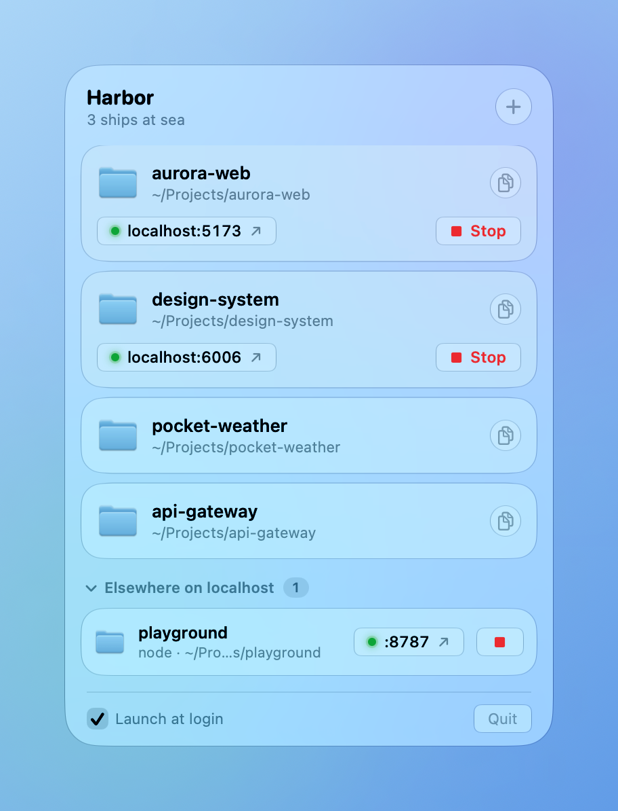

# ⛵ Harbor

A tiny Liquid Glass menu bar app for macOS that keeps your project folders close and your localhost servers in check.

<p align="center">
  <picture>
    <source media="(prefers-color-scheme: dark)" srcset="docs/screenshot-dark.png">
    
  </picture>
</p>

- **Pin folders** and copy their full path with a single click. Press and hold a folder to drag it into a new order.
- **See what's running**: Harbor spots dev servers listening on localhost and matches them to your pinned projects
- **Stop servers** right from the menu bar, no hunting for the right terminal tab
- **Open in your tools**: reveal in Finder, or open in your editor (Cursor, Zed, VS Code) or terminal (Ghostty, iTerm, Warp, Terminal)
- The menu bar icon shows how many servers are running, and the panel notices servers outside your pinned folders too

Built with SwiftUI and the macOS Liquid Glass APIs. No dependencies.

## Requirements

- macOS 26 or later
- Xcode 26 or later and [XcodeGen](https://github.com/yonaskolb/XcodeGen) (`brew install xcodegen`) to build

## Building

```sh
xcodegen generate
xcodebuild -scheme Harbor -configuration Release -derivedDataPath build build
cp -R build/Build/Products/Release/Harbor.app /Applications/
```

The Xcode project is generated from `project.yml` and isn't checked in.

## How it works

Harbor runs `lsof` to find TCP ports that are listening, then reads each process's working directory with `libproc`. A server belongs to a pinned folder when its working directory is inside that folder. **Stop** sends `SIGTERM` and follows up with `SIGKILL` if the process is still running after two seconds.

Because it inspects and stops other processes, Harbor runs outside the App Sandbox.

## Development tips

- `open Harbor.app --args -HarborPreview YES` opens the panel in a standalone window over a backdrop, for screenshots. Add `-HarborAppearance light` or `dark` to force a theme. Preview mode never saves pins, so you can pass demo pins as a launch argument (`-pinnedFolders "<hex-encoded JSON>"`) without touching your real ones.
- `swift scripts/make-icon.swift icon.png` re-renders the app icon.
